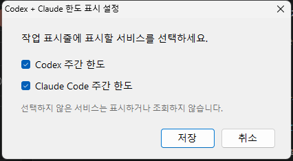

# v1.1.0 · 사용하는 서비스만 표시

Codex와 Claude Code 중 **구독해서 사용하는 서비스만 작업 표시줄에 표시**할 수 있습니다. 남길 아이콘을 오른쪽 클릭 → **표시 설정...** → 원하는 서비스만 선택 → **저장**하세요. 숨긴 서비스의 조회기도 중지합니다. 남은 아이콘에서 다시 설정을 열어 둘 다 표시할 수 있으며, 설치 파일을 다시 실행해도 선택이 유지됩니다.

설정 변경 때 이미 사용 중인 조회기는 다시 시작하지 않습니다. Claude 요청이 일시적으로 제한되면 `--%`로 정상값을 지우는 대신, 같은 계정의 30분 이내 마지막 정상값을 `~83%`처럼 구분해 표시합니다. 오른쪽 클릭에서 상태와 마지막 정상 조회 시각을 볼 수 있습니다. 계정 연동은 각 CLI의 기존 로그인으로 이루어집니다.

## 다운로드

**[CodexClaudeQuotaTray-Setup.exe](https://github.com/kjhbond/claude-gpt-usage-tray/releases/download/v1.1.0/CodexClaudeQuotaTray-Setup.exe)** · Windows 11 x64

SHA-256: `CC0D318FEA65F411128B2FBC1BD192C45A4B2F61C811F5F943D4A3422416982A`

Python 3과 `pythonw.exe`가 필요합니다. **표시할 서비스의** CLI만 npm으로 설치하고 로그인하면 됩니다. 처음에는 두 아이콘이 보이므로, 하나만 사용한다면 설치 후 표시 설정에서 다른 아이콘을 숨기세요. 코드 서명되지 않은 개인 빌드입니다.

[설치·사용 안내](docs/START_HERE.md) · [계정 연동 방식](docs/ACCOUNT.md) · [문제 해결](docs/TROUBLESHOOTING.md) · [소스 구조](docs/ARCHITECTURE.md)

설치된 Windows 11 x64 작업 표시줄에서 Codex만·Claude만·둘 다 표시, 숨긴 조회기 중지, 켜진 조회기 유지, 설정 보존과 복원, 이전값 표시를 확인했습니다. 다른 Windows 빌드의 작업 표시줄은 추가 검증이 필요합니다.

---

# v1.0.0 · Windows 11 x64 첫 공개 배포

Codex와 Claude Code의 **주간 잔여 한도**를 Windows 11 작업 표시줄 알림 영역 옆에 표시합니다. 마우스를 올리면 리셋 시각을 `월-일(요일) 시:분 한국시간` 형식으로 볼 수 있습니다. 왼쪽 클릭은 웹 채팅을 열고, 오른쪽 클릭은 계정·리셋·최근 조회 시각을 보여줍니다.

## 다운로드

**[CodexClaudeQuotaTray-Setup.exe](https://github.com/kjhbond/claude-gpt-usage-tray/releases/download/v1.0.0/CodexClaudeQuotaTray-Setup.exe)** · Windows 11 x64

SHA-256: `01A6B45E548FCD6FE589082402703DAF7AF45478BE4F3EECB5534E5A9DB6BF4F`

## 설치 전 확인

- Python 3과 `pythonw.exe`
- npm 전역 패키지로 설치하고 각 계정에 로그인한 Codex CLI·Claude Code
- 처음 조회와 작업 표시줄 기호 검색을 위한 인터넷 연결

설치 파일은 Python·두 CLI·로그인을 자동으로 준비하지 않습니다. 코드 서명되지 않은 개인 빌드입니다. 설치 후 해당 서비스가 `--%`이면 로그인을 확인하고 [문제 해결 안내](docs/TROUBLESHOOTING.md)를 보세요.

## 안내

[설치·사용 안내](docs/START_HERE.md) · [화면 소개](docs/OVERVIEW.md) · [개인정보와 데이터 흐름](docs/PRIVACY.md)

설치 파일에는 portable Windhawk가 포함되어 현재 Windows 계정 로그인 시 자동 시작합니다. 현재 배포판은 Windows 11 x64의 유지 관리자 PC에서 설치와 작업 표시줄 표시를 확인했습니다. 다른 Windows 빌드와 화면 배치는 추가 검증이 필요합니다. Claude 사용량 조회 주소는 공개 문서화된 안정 API가 아니어서 나중에 변경될 수 있습니다.
