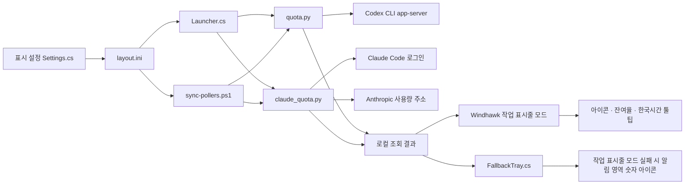

# 소스 구조와 데이터 흐름

이 저장소에는 Windows 작업 표시줄 모드, 두 한도 조회기, 표시 설정, 설치기 소스가 있습니다. 설치 파일에 포함하는 Windhawk portable 런타임은 저장소의 소스 파일이 아니며 [공식 Windhawk](https://github.com/ramensoftware/windhawk)에서 가져옵니다.

## 주요 파일

| 파일 | 역할 |
| --- | --- |
| `codex-weekly-quota.wh.cpp` | Windows 11 작업 표시줄 XAML에 두 버튼을 만들고 `layout.ini` 표시 옵션, 조회 결과, 툴팁과 오른쪽 클릭 메뉴를 반영합니다. |
| `Settings.cs` | 사용자가 Codex·Claude Code 표시 여부를 고릅니다. 최소 하나를 선택하게 하고 `sync-pollers.ps1`을 호출합니다. |
| `Launcher.cs` | Windows 로그인 시 Windhawk, 예비 숫자 아이콘, 선택된 서비스의 Python 조회기를 시작합니다. |
| `FallbackTray.cs` | 기본 작업 표시줄 버튼을 감지하고, 버튼이 없으면 알림 영역에 잔여율 숫자 아이콘을 표시합니다. 버튼이 돌아오면 예비 아이콘을 숨깁니다. |
| `sync-pollers.ps1` | 설정 변경 시 숨긴 조회기만 중지하고 새로 켠 조회기만 시작합니다. 이미 실행 중인 조회기는 그대로 둡니다. |
| `quota.py` | 로컬 Codex app-server에 계정·주간 한도를 읽기 전용으로 요청합니다. |
| `claude_quota.py` | Claude Code OAuth 로그인 정보를 이용해 `seven_day` 사용량을 조회합니다. |
| `display_state.py` | 정상값, 일시적 실패의 `~이전값`, 사용 불가 `--%`를 결정합니다. 계정이 바뀌거나 30분이 지나면 이전값을 표시하지 않습니다. |
| `metadata.py` | 리셋·조회 시각을 한국시간의 `MM-DD(요일) HH:MM` 형식으로 저장하고 상태 설명을 만듭니다. |
| `installer/Setup.cs`, `installer/build-installer.py` | 계정 데이터 없이 설치 파일을 만들고 현재 Windows 사용자에게 설치합니다. 업데이트 때 `layout.ini`를 보존합니다. |

## 로컬 파일과 외부 요청

설치 위치는 `%USERPROFILE%\CodexQuotaWidget`입니다. `quota.json`과 `claude-quota.json`에는 마지막 조회 상태가, `*-info.ini`에는 작업 표시줄에 보여줄 계정·시각·상태가, `display.txt`와 `claude-display.txt`에는 짧은 표시 문자열이 기록됩니다. 자격 증명·계정별 상태 파일은 저장소와 설치 파일에 포함하지 않습니다.

Codex 조회는 로컬 CLI app-server를 통하며, Claude 조회는 Anthropic으로 직접 요청합니다. 두 조회기는 새 모델 대화를 시작하지 않습니다. Claude 사용량 주소는 문서화된 공개 안정 API가 아니므로 호환성 제한이 있습니다. [계정 연동 안내](ACCOUNT.md)와 [개인정보 안내](PRIVACY.md)를 함께 보세요.

## 빌드와 확인

[빌드 명령](BUILD.md)을 실행한 뒤 Python 단위 테스트, 설치 파일 ZIP 무결성·개인정보 제외 검사, Windows 작업 표시줄에서 실제 버튼 표시와 한도 전환을 각각 확인합니다. 소스의 테스트 통과만으로 Windows 작업 표시줄 동작이 보장되지는 않습니다.
