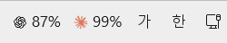

# 한눈에 보는 위젯

Codex와 Claude Code를 함께 쓰는 Windows 11 사용자에게 주간 잔여 한도와 리셋 시각을 작업 표시줄에서 보여줍니다. 브라우저나 CLI를 열지 않아도 어느 쪽에 사용 여유가 있는지 확인할 수 있습니다.

## 화면 읽는 법

| 화면 요소 | 뜻 |
| --- | --- |
| ChatGPT 아이콘 + `87%` | Codex **주간 잔여** 비율. 13% 사용했다는 예시입니다. |
| Claude 아이콘 + `99%` | Claude Code **주간 잔여** 비율. 1% 사용했다는 예시입니다. |
| `--%` | 최근 조회에 실패했거나 해당 계정에 사용할 수 있는 주간 한도가 없습니다. |
| `~83%` | 최근 조회가 일시적으로 실패해, 같은 계정의 30분 이내 이전 정상값을 보여줍니다. |
| 마우스 오버 | `주간 리셋: 09-30(수) 18:00 한국시간` 형식. 연도 없이 한국 요일·시각으로 표시합니다. |
| 오른쪽 클릭 | 선택한 서비스의 계정 ID, 리셋 시각, 최근 조회 시각, 조회 상태, 표시 설정과 계정 연동 안내. |
| 왼쪽 클릭 | 선택한 서비스의 웹 채팅 열기. |

한 서비스만 사용한다면 남길 아이콘을 오른쪽 클릭하고 **표시 설정...**에서 원하는 서비스만 체크하세요. 선택하지 않은 아이콘은 사라지고 한도 조회도 멈춥니다. 표시된 아이콘에서 같은 설정을 다시 열어 복원할 수 있습니다.

숫자는 **매주 리셋되는 Codex/Claude Code 한도**를 뜻합니다. ChatGPT 또는 Claude의 일반 웹 채팅 메시지 한도를 뜻하지 않습니다. 실제 서비스 화면과 갱신 시점에 차이가 날 수 있으며, 소수점 이하는 버립니다.

## 사용 흐름

1. 두 CLI를 설치하고 각각 사용할 계정으로 로그인합니다.
2. [설치 파일](https://github.com/kjhbond/claude-gpt-usage-tray/releases/latest/download/CodexClaudeQuotaTray-Setup.exe)을 실행합니다.
3. 작업 표시줄 오른쪽에서 두 아이콘과 백분율을 확인합니다.
4. 리셋 시각이 필요할 때 해당 아이콘에 마우스를 올립니다.
5. `--%`가 지속되면 [문제 해결](TROUBLESHOOTING.md)을 순서대로 확인합니다.

## 지원 범위

현재 설치 파일은 Windows 11 x64와 해당 사용자의 로컬 CLI 로그인을 대상으로 합니다. Python 3과 **표시하려는 서비스의** npm 방식 CLI가 필요합니다. 다른 OS, WSL 내부 로그인만 있는 환경, npm 이외의 CLI 설치 방식, 조직별 프록시 설정은 검증하지 않았습니다. Windows 업데이트로 작업 표시줄 내부 구조가 바뀌면 Windhawk 모드가 영향을 받을 수 있습니다. 이때 알림 영역의 예비 숫자 아이콘이 잔여율을 표시합니다.
